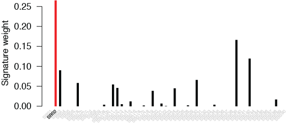

# MisMatchFinder
The MisMatchFinder algorithm identifies mismatches within reads compared to the reference genome and filters background noise unrelated to somatic mutations through:
 * the use of high thresholds for mapping and base quality,
 * strict consensus between overlapping read-pairs,
 * gnomAD-based germline variant filtering​,
 * and a ctDNA-centric fragmentomics filter


# Run MisMatchFinder
The easiest way is downloding the binary file of MismatchFinder and running it.  
The reference files (gnomAD echtvar for the germline variant filter and human GRCh38 high mappability regions for the whitelist bed file) and demo files can be downloaded in [Zenodo repository](https://zenodo.org/records/12754454).  
We recommend to use MisMatchFinder with the quality filter, the germline filter, and the fragmentomics filter as the following settings:  
```
./mismatchfinder --germline_file gnomad.v3.1.2.echtvar.v2.zip --only-overlaps --strict-overlap --whitelist_bed GCA_000001405.15_GRCh38_full_analysis_set.100mer.highMappability.bed -o $OUTPUT_FOLDER $INPUT_BAM
```
Other parameters can be set as default. 

# Installation
Install time is 100% dependent on the compile time and therefore different between systems, but on a standard x86 laptop compile time is typically less than 2 minutes.

Requirements: Rust

1. Clone this repository
2. Build the release optimised binary with ```cargo build -r```
3. Move the binary (```target/release/mismatchfinder```) into the ```$PATH```

# Usage

To ensure optimal results, please use the gnomAD echtvar as the germline filter (available from [https://github.com/brentp/echtvar/releases](https://github.com/brentp/echtvar/releases)) or an eqivalent echtvar file and refer to [echtvar release](https://github.com/brentp/echtvar/releases/tag/v0.1.9) to download the echtvar reference for gnomad v3.1.2.  
To ensure optimal mapping rates and no mapping related mismatches, the analysis was restricted to high mappability areas of the genome. These areas were defined as regions, where a k-mer of 100bp had a 85% or higher unique mappability rate. The mappability tracks were first computed with [GEM](https://doi.org/10.1371/journal.pone.0030377) and then collated converted to a bed file with R just like in the best practice instructions of [QDNAseq](https://doi.org/10.1101/gr.175141.114) for creating a new bin annotation. This method was only required for [GRCh38](https://genome.cshlp.org/content/27/5/849.long) as so far, the UCSC mappability data track was only available for [GRCh37](https://doi.org/10.1371/journal.pbio.1001091).
```
USAGE:
    mismatchfinder [OPTIONS] --output <OUTPUT_FOLDER> [--] [BAMS]...

ARGS:
    <BAMS>...    Bams to analyse

OPTIONS:
        --blacklist_bed <BLACKLIST_FILE>
            Bed file for genomic regions to ignore in the analysis. White list bed file regions
            overwrite black list regions

        --fragment_length_intervals <FRAGMENT_LENGTH_INTERVALS>...
            Length of fragments to be considered in the analysis [default: 100-150 250-325]

        --germline_file <GERMLINE_FILE>
            File to read germline information from default is an echtvar file

    -h, --help
            Print help information

        --maximum_edit_distance_per_read <MAX_EDIT_DISTANCE_PER_READ>
            Maximum mismatches we allow in the read [default: 15]

        --minimum_average_base_quality <MIN_AVERAGE_BASE_QUALITY>
            Mimimum average base quality of the read [default: 25]

        --minimum_edit_distance_per_read <MIN_EDIT_DISTANCE_PER_READ>
            Mimimum mismatches we require in the read [default: 1]

    -o, --output <OUTPUT_FOLDER>
            Output folder to write files to

        --only_overlaps
            only use the overlap of the two reads

        --overwrite
            overwrite previous results

    -q, --minimum_mapping_quality <MIN_MAPPING_QUALITY>
            Mimimum mapping quality for a read to be considered [default: 20]

    -Q, --minimum_base_quality <MIN_BASE_QUALITY>
            Mimimum base quality of the mismatch (BQ is summed for a readpair if reads agree)
            [default: 65]

        --strict_overlaps
            only analyse mismatches if the read pair agree (does not restrict to only overlap)

    -V, --version
            Print version information

        --whitelist_bed <WHITELIST_FILE>
            Bed file for genomic regions to include in the analysis. White list bed file regions
            overwrite black list regions [default: all regions]
```

# Example analysis

The demo file can be downloaded from [the Zenodo repository](https://doi.org/10.5281/zenodo.12754454).  
With the [plasma_DNA_demo.bam](https://doi.org/10.5281/zenodo.12754454) runing the recommended analysis we generate the vcf output [plasma_DNA_demo_bamsites.vcf.gz](https://doi.org/10.5281/zenodo.12754454).  
Note, the plasma_DNA_demo.bam is simulated human plasma sequencing data of chromosome 19. This file and the corresponding MisMatchFinder output (plasma_DNA_demo_bamsites.vcf.gz) should only be used for the sanity testing of MisMatchFinder.  
Runtime of this step should be around 1 minute on the test data
```
$ ./mismatchfinder --germline_file ./gnomad.v3.1.2.echtvar.v2.zip --only-overlaps --strict-overlap --whitelist_bed ./GRCh38/GCA_000001405.15_GRCh38_full_analysis_set.100mer.highMappability.bed -o ./ ./plasma_DNA_demo.bam
[...]
2024-07-25T02:43:06.046Z INFO [mismatchfinder::bamreader] Read through 500000 reads - last position: chr19:2166611
2024-07-25T02:43:10.994Z INFO [mismatchfinder::bamreader] Read through 1000000 reads - last position: chr19:7187256
2024-07-25T02:43:15.826Z INFO [mismatchfinder::bamreader] Read through 1500000 reads - last position: chr19:12206428
2024-07-25T02:43:20.547Z INFO [mismatchfinder::bamreader] Read through 2000000 reads - last position: chr19:17233978
2024-07-25T02:43:25.016Z INFO [mismatchfinder::bamreader] Read through 2500000 reads - last position: chr19:22267393
2024-07-25T02:43:29.785Z INFO [mismatchfinder::bamreader] Read through 3000000 reads - last position: chr19:30091487
2024-07-25T02:43:35.071Z INFO [mismatchfinder::bamreader] Read through 3500000 reads - last position: chr19:35125341
2024-07-25T02:43:39.805Z INFO [mismatchfinder::bamreader] Read through 4000000 reads - last position: chr19:40158104
2024-07-25T02:43:44.578Z INFO [mismatchfinder::bamreader] Read through 4500000 reads - last position: chr19:45167451
2024-07-25T02:43:49.456Z INFO [mismatchfinder::bamreader] Read through 5000000 reads - last position: chr19:50184626
2024-07-25T02:43:54.169Z INFO [mismatchfinder::bamreader] Read through 5500000 reads - last position: chr19:55189136
2024-07-25T02:43:57.352Z INFO [mismatchfinder::bamreader] Analysed 2786344 fragments and 4871 were excluded due to wrong length, leaving 1870325 after whitelist and base quality (excluded: 0) check
2024-07-25T02:43:57.352Z INFO [mismatchfinder] Found 1982 mismatches 
2024-07-25T02:43:59.321Z INFO [mismatchfinder] Found 1623 somatic mismatches
```

once we have the vcf (can be found in the [Zenodo](https://doi.org/10.5281/zenodo.12754454) or [example](example/plasma_DNA_demo_bamsites.vcf.gz)), we can perform signature deconvolution in R with user desired tools. For example, we used sigminer(v2.3.0) with COSMIC mutational signature v3.2 for the demostration. 

```R
library(data.table)
library(sigminer)
library(BSgenome.Hsapiens.UCSC.hg38)
library(dlfUtils)

######## mutational signature fitting ########
vcf_file <- "./example/plasma_DNA_sort_rmd_bamsites.vcf.gz"
maf_file <- sigminer::read_vcf(vcf_file, genome_build = "hg38")
tally <- sigminer::sig_tally(maf_file, mode="SBS", ref_genome="BSgenome.Hsapiens.UCSC.hg38")
expo_SBS <- sig_fit(t(tally$nmf_matrix), sig_index = "ALL", sig_db = "SBS", return_class = "data.table",type="absolute")

######## remove sequencing artefacts signatures ########
seqartefacts <- c("SBS27","SBS43","SBS45","SBS46","SBS47","SBS48","SBS49","SBS50",
                  "SBS51","SBS52","SBS53","SBS54","SBS55","SBS56","SBS57","SBS58",
                  "SBS59","SBS60")
expo_SBS <- expo_SBS[,(seqartefacts):=NULL]

######## renormalisation ########
expo_SBS_normalised <- expo_SBS[,-1]/rowSums(expo_SBS[,-1])
demo_sig <- cbind(expo_SBS[,1], expo_SBS_normalised)

######## plot the signature weights (highlighting SBS2) ########
plot(1:ncol(demo_sig[,-1]), round(demo_sig[1,-1], digits=5), type='h', lwd=4, lend=1, col=ifelse(colnames(demo_sig[1,-1])=="SBS2", "red", "black"), xlab="", ylab="Signature weight", las=2, xaxt='n', bty='n')
text(1:ncol(demo_sig[,-1]), line2user(0,1), labels = colnames(demo_sig[,-1]), srt=45, adj=1, cex=0.5, xpd=TRUE, col=ifelse(colnames(demo_sig[1,-1])=="SBS2", "black", "lightgrey"))
```

the output on the test data will look similar to this


